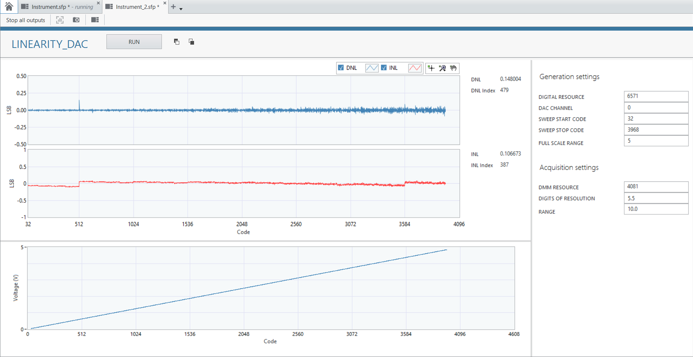

# DAC
This repo provides measurement plugins for general purpose / precision DAC DUTs. The test generates the digital waveform  and acquires the analog signal and measures it.

 

## Key Features
- Measurements
    - Linearity Measurement
    - Single Tone Measurement

## Hardware setup:
- NI 657x
- NI 4081 (for Linearity measuremenet)
- NI 5922 (for Single Tone measurement)
- SMU or power supply (note: the software does not use the SMU/power supply but need something to power the DUT)

## Software dependencies:
- LabVIEW 64-bit 2021.0 SP1
- MeasurementLink 2024 Q1
- MeasurementLink Dependencies (https://github.com/ni/measurementlink-labview/releases/tag/v2.0.0.1)
- NI Digital driver (22.8 or higher)
- NI DMM driver (22.8 or higher)
- NI Scope driver (22.8 or higher)
