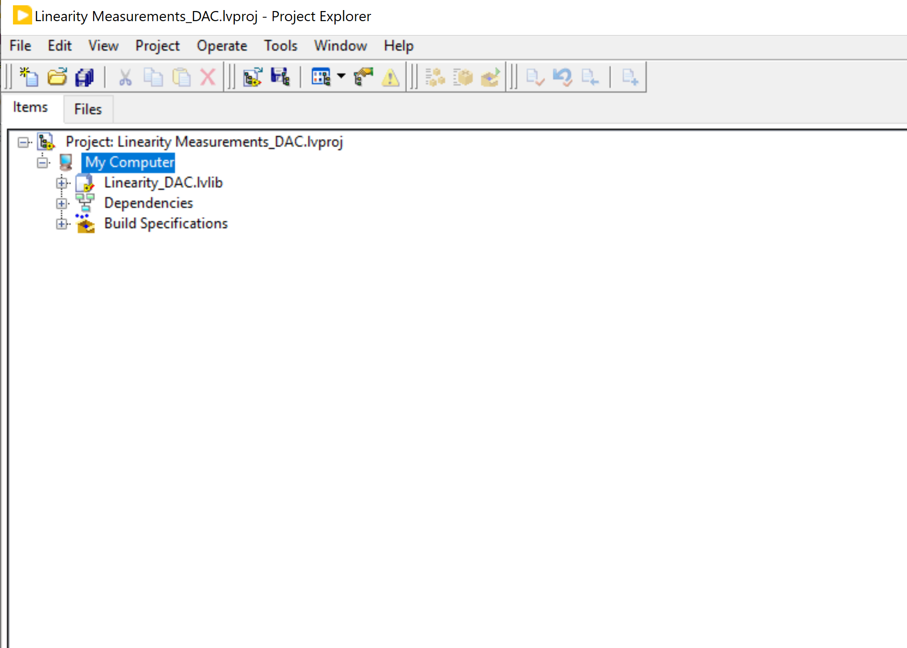
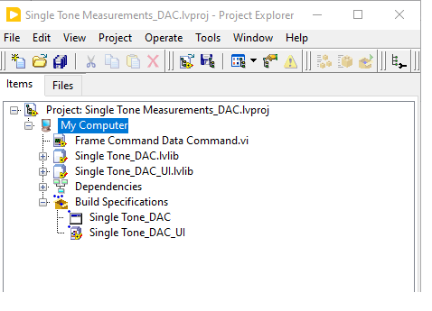
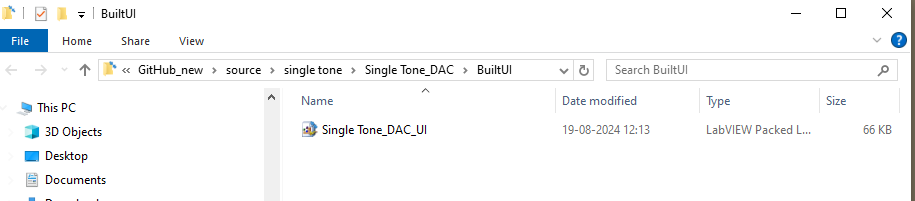
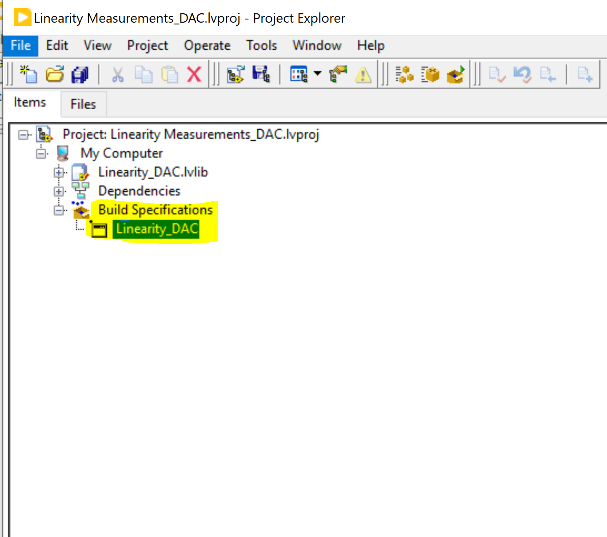
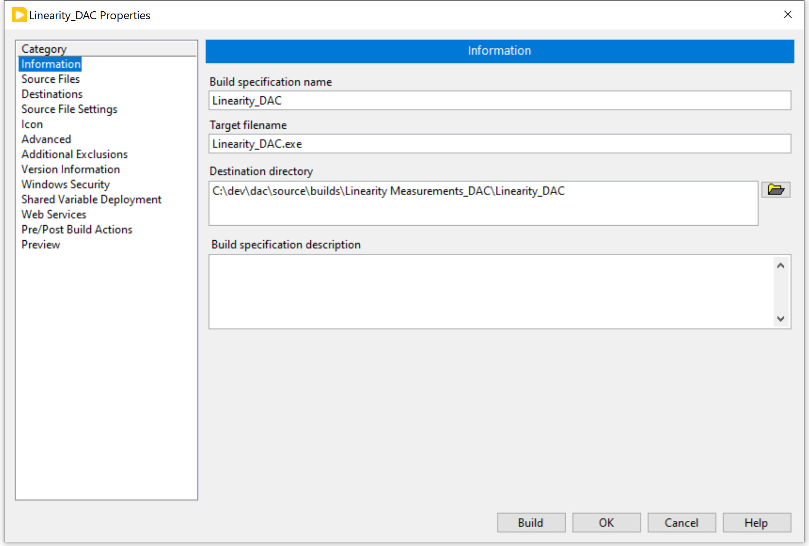
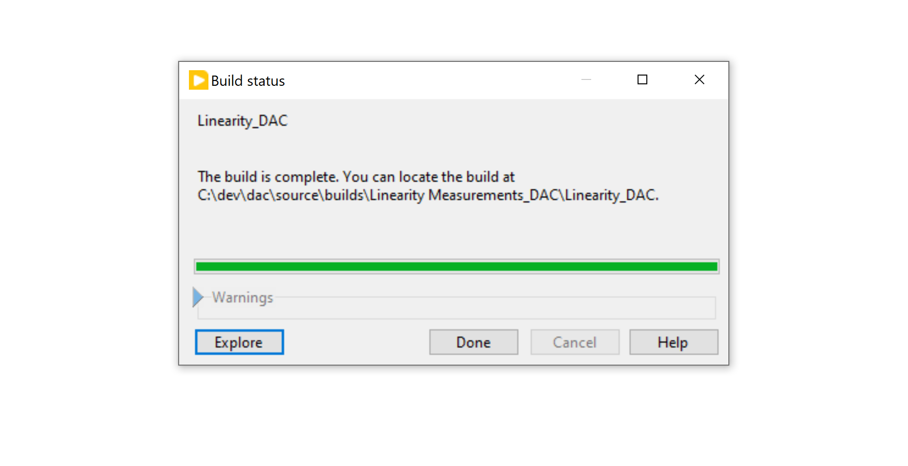
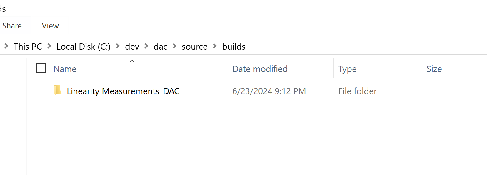
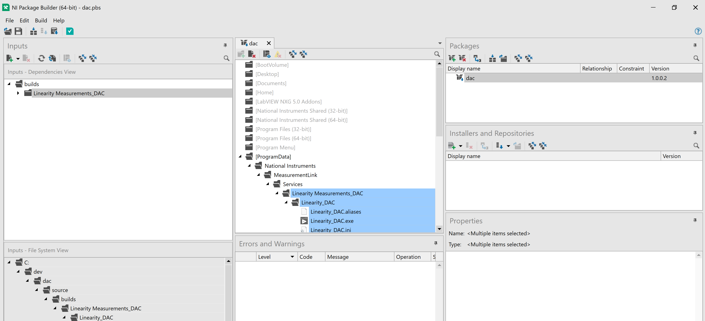
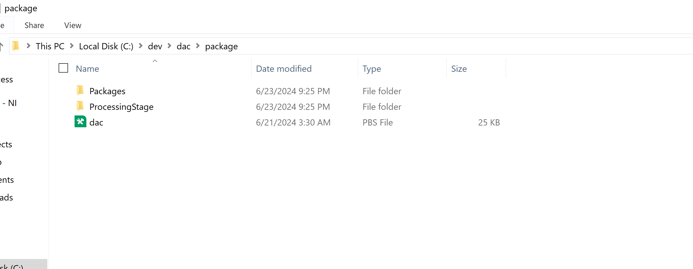
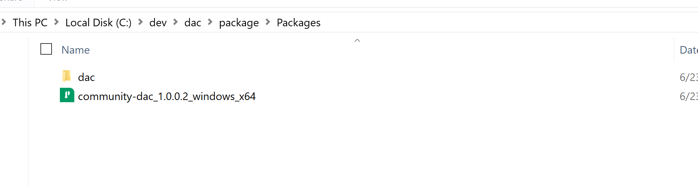

## Build EXE for each measurement
Breif explanation on how to create a build for dac measurement .exe by taking Linearity measurement as an example.
1. Open the measurement lvproj for which you would like to build EXE and select 'Build Specifications'.
    
    

2. Right click the build spec for UI (if present) and click 'Build' (this step can be skipped for lvproj wihout UI build spec).

    

3. Once the build is complete, 'BuiltUI' folder can be seen under the measurement folder.

    

4. Right click the build spec for EXE and clilck 'Build'.

    

5. Build Spec.
    
    

6. Once the build is completed, can able to see below window and with explore you can able to go to build created location
    
    

7. The Linearity measurement build folder created under "data-converter-validation-module\Builds"
    
    

    
Note: Please note that the /build folder must not be committed to repo and will be ignored by .gitignore upon commit.

## Build NIPKG for the plugin

1. Open the adc-measurements.pbs NI package build spec in "data-converter-validation-module\package"
    
    

2. Ensure the destination for the package installation is set to the below location:
    "C:\ProgramData\National Instruments\MeasurementLink\Services"

    

3. Click on 'Build Solution'.

    

4. Once the build process is completed, the package build files and processing folder created in the package folder.
    
   
    

5. Select the package file "data-converter-validation-module_1.0.0.0_windows_x64" to install the dcvm build into the machine.

    

    
Note: Please note that the built NIPM packages must not be committed to repo. The folders created upon building NI PKG (Packages, ProcessingStage) will be ignored by .gitignore upon commit.

## Create and Update NIPM Feeds
1. The NIPM packages for different measurement plugins are added to an NIPM feed. So the users can install new packages or receive updates on existing feeds by subscribing to the feed.

2. The feeds for Measurement plugins are maintained under the below repo.
https://github.com/NI-MeasurementLink-Plug-Ins/package-manager-feeds

3. Please follow the procedure mentioned in below document for adding new packages or updating new versions of existing packages to the feed.
https://github.com/NI-MeasurementLink-Plug-Ins/package-manager-feeds/blob/main/package-feed-updater/README.md

